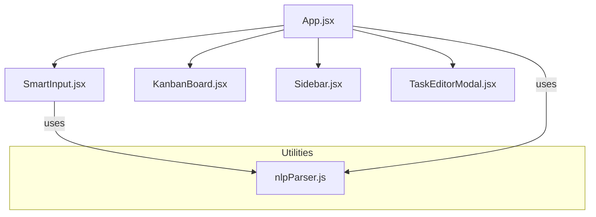

# Synapse Collaboration - Technical Architecture Guide

This document explains the core technical subsystems, component relationships, state management patterns, and utility engines that power Synapse Collaboration.

---

## 🧩 Component Architecture

Synapse is structured as a single-page application with modular, single-responsibility components communicating through React state boundaries:

### 1. Root Component (`App.jsx`)
*   **Role**: Serves as the central state hub and conductor of the app.
*   **Key Responsibilities**:
    *   Maintains the primary states: `tasks` (all issues on the board), `logs` (activity timeline), and simulator controls.
    *   Coordinates task operations: `handleAddTask`, `handleUpdateTask`, `handleDeleteTask`, and reset functions.
    *   Hosts the **Multi-User Simulation Engine** to run independent active loops.
    *   Implements the root dashboard structural toggles (`isSidebarOpen` & `isSmartInputCollapsed`).

### 2. Kanban Board Canvas (`components/KanbanBoard.jsx`)
*   **Role**: Renders the 4-column agile workspace (Cần làm, Đang làm, Đang review, Hoàn thành).
*   **Key Responsibilities**:
    *   Filters and distributes tasks into columns based on their `status`.
    *   Handles interactive HTML5 Drag & Drop API for moving tasks between columns and updates parent status.
    *   Supports contentEditable title edits with smart focus/blur state controls.
    *   Hosts three **Inline Selection Popovers** (Assignee badge, Priority badge, Due date selector) for instant changes without opening the full modal.

### 3. NLP Smart Input (`components/SmartInput.jsx`)
*   **Role**: Implements the AI-powered text box that converts natural text commands into structured tasks.
*   **Key Responsibilities**:
    *   Wraps a double-layered layout: a transparent textarea overlayed on a syntax-highlighter `div` containing highlighted tokens.
    *   Renders autocomplete dropdowns when typing `@` or `/` or `#`.
    *   Synchronizes visual token parsing in real time using the `parseTaskText` utility.
    *   Allows quick submission via `Enter` or clicking the AI Sparkles icon.

### 4. Right Sidebar Panel (`components/Sidebar.jsx`)
*   **Role**: Renders the collapsible accordion panels for "Thành viên đội ngũ" (Team Directory) and "Nhật ký hoạt động" (Activity Feed).
*   **Key Responsibilities**:
    *   Implements independent sectional toggling (saved in local storage).
    *   Listens to Drag & Drop events: users can drag any task card from the Kanban board and drop it directly onto a team member's card to re-assign it instantly.
    *   Subscribes to simulated typing states to show pulsing glow markers.

### 5. Detailed Editor (`components/TaskEditorModal.jsx`)
*   **Role**: Renders the glassmorphic detail page modal on card double-click or edit action.
*   **Key Responsibilities**:
    *   Provides full editable forms for titles, descriptions, due dates, assignee lists, and tag editors.
    *   Supports a comprehensive multi-user comments thread synchronized to the specific task card.

---

## 🧠 The Custom NLP Parser Engine (`src/utils/nlpParser.js`)

At the core of Synapse is a custom text tokenization engine capable of parsing natural language text patterns in both English and Vietnamese:

### 1. Vietnamese Tone Normalization (`removeVietnameseTones`)
Because Vietnamese input methods often produce diacritics that make exact string matches difficult, the parser implements a heavy-duty accent removal utility that transforms complex accented characters into standardized ASCII equivalents. This ensures that a user typing `#cao` (high priority) or `ngày mai` (tomorrow) will match correctly regardless of Unicode encoding differences.

### 2. Tokenizer Pipeline (`parseTaskText`)
The parser splits input text into words and parses them in a single pass:
*   **Assignees (`@username`)**: Tokens starting with `@` are matched against the available `USERS` array. If found, the user profile is attached and a token type of `assignee` is marked.
*   **Priorities (`#keys`)**: Tokens starting with `#` are checked against pre-configured priority trigger keys (e.g. `#cao`, `#high` $\rightarrow$ `high`; `#vua`, `#medium` $\rightarrow$ `medium`; `#thap`, `#low` $\rightarrow$ `low`).
*   **Tags (`#tag`)**: Any hashtag token not matched as a priority is classified as a general tag.
*   **Commands (`/command`)**: Identifies slash actions.
*   **Dates (Regex & Semantic NLP)**: First searches the full phrase for semantic date matches:
    *   *Relative Days*: `hôm nay`, `ngày mai`, `ngày kia`, `tuần sau`.
    *   *Weekdays*: `thứ hai`, `thứ sáu`, `monday`, `sun` (supports suffix offsets like "thứ sáu tuần sau").
    *   *Calendar Dates*: Matches regex formats `dd/mm` or `dd-mm` and handles year boundaries.
    *   *Numeric Offsets*: Matches semantic patterns like `2 ngày nữa`, `3d`, `5 days`.

---

## 🤖 Multi-User Real-Time Simulation Engine

To make the dashboard feel alive, `App.jsx` implements a background multi-user simulation engine that mimics actual collaborative activity:

1.  **Interval Trigger**: An active loop triggers every 18 seconds.
2.  **Typing Simulation**: A random offline team member is selected, and their status indicator lights up as a pulsing purple `typing` glow for 3 seconds.
3.  **Collaborative Action Execution**:
    *   **Action A (40% probability)**: The simulated member moves a task assigned to them from its current column to the next status column (e.g. *Todo* $\rightarrow$ *In Progress* $\rightarrow$ *Review* $\rightarrow$ *Done*) and writes a detailed log entry.
    *   **Action B (40% probability)**: The simulated member creates a brand new task using the NLP engine! It randomly pulls a structured natural language string (e.g., `@huy #cao Sửa lỗi CSS trên giao diện Safari ngày mai`) and adds it directly to the board, parsing it in real-time.
    *   **Action C (20% probability)**: The simulated member reviews a task in the *Review* column and marks it as *Done*.
4.  **Logging**: Every single action writes a system event with matching icons and timestamps.

---

## 💾 Local Storage Schema

The application keeps states fully synchronized to local browser storage, ensuring absolute persistence upon refreshes:

| LocalStorage Key | Data Type | Description |
| :--- | :--- | :--- |
| `synapse_tasks` | `Array<Task>` | Structured list of all cards, priorities, creators, assignees, dates, tags, and comments. |
| `synapse_logs` | `Array<Log>` | List of the 50 most recent activity logs. |
| `synapse_smart_input_collapsed` | `boolean` | State representing if the AI Smart Input area is minimized. |
| `synapse_sidebar_open` | `boolean` | State representing if the right sidebar container is visible. |
| `synapse_sidebar_collapsed` | `Object` | Accordion states of the sidebar (`{ team: boolean, activity: boolean }`). |
