# Synapse Collaboration - Core Code Principles Guide

This guide details the exact operational principles, mathematical models, rendering mechanisms, and event flow algorithms that run under the hood of the Synapse Collaboration codebase. It serves as a direct technical manual for developers and AI LLMs wishing to refactor or build features on top of existing modules.

---

## 📑 Table of Contents
1.  [Double-Layer NLP Syntax Highlighter Textarea](#1-double-layer-nlp-syntax-highlighter-textarea)
2.  [Vietnamese Semantic Date & Token Parsing Pipeline](#2-vietnamese-semantic-date--token-parsing-pipeline)
3.  [Flexbox Collapsible Sliding Transitions & CSS :has Selector](#3-flexbox-collapsible-sliding-transitions--css-has-selector)
4.  [HTML5 Drag & Drop Event & State Sync Pipeline](#4-html5-drag--drop-event--state-sync-pipeline)

---

## 1. Double-Layer NLP Syntax Highlighter Textarea

### 🔹 The Core Problem
In standard HTML/React, a `<textarea>` is a plain-text element. It is impossible to colorize individual words (like making `@lan` green, `#cao` red, or `ngày mai` cyan) inside a standard textarea.

### 🔹 The Double-Layer Principle
Synapse solves this by wrapping two separate visual layers directly on top of each other inside `.input-backdrop-container` in `src/components/SmartInput.jsx`:

```text
[ Layer 2: Transparent Textarea (Z-Index: 2) - For User Typing & Caret ]
                  | (Overlayed exactly on top)
[ Layer 1: Highlighter Div (Z-Index: 1) - For HTML Token Highlighting  ]
```

1.  **Highlighter Div (`.textarea-highlighter`)**: Positioned absolutely at `(top: 0, left: 0)`. It contains the formatted HTML string with colored `<span>` tags matching the parsed tokens. The actual text color is transparent *except* for the highlighted token blocks which have vibrant neon colors.
2.  **Textarea (`.smart-textarea`)**: Positioned relatively on top. The background is completely transparent (`background: transparent`), but the text is standard white, overlaying the highlighter perfectly.

### 🔹 Synchronizing Metrics (Critical CSS Rules)
For the visual overlay to align exactly down to the single-pixel level, both elements must share identical text-rendering metrics. In `src/index.css`, they are configured with:
```css
.textarea-highlighter, .smart-textarea {
  font-family: var(--font-body);
  font-size: 15px;
  line-height: 1.5;
  padding: 18px 50px 18px 20px;
  width: 100%;
  min-height: 56px;
  white-space: pre-wrap;
  word-wrap: break-word;
  box-sizing: border-box;
  letter-spacing: normal;
  word-spacing: normal;
  font-weight: 400; /* Must match exactly */
}
```

### 🔹 Scroll Synchronization Algorithm
When the user types a very long sentence that overflows and scrolls, the two layers must scroll in perfect lockstep. `SmartInput.jsx` implements a scroll event listener:
```javascript
const handleScroll = () => {
  if (highlighterRef.current && textareaRef.current) {
    highlighterRef.current.scrollTop = textareaRef.current.scrollTop;
    highlighterRef.current.scrollLeft = textareaRef.current.scrollLeft;
  }
};
```
This listener is bound to the `onScroll` hook of the `<textarea>`, ensuring that scroll offsets are copied immediately to the background div, keeping tokens perfectly aligned during scroll events.

---

## 2. Vietnamese Semantic Date & Token Parsing Pipeline

The parser in `src/utils/nlpParser.js` runs a single-pass tokenization and extraction function: `parseTaskText(text)`.

### 🔹 Tone Normalization Algorithm
Vietnamese tones (huyền, sắc, hỏi, ngã, nặng) contain various Unicode diacritic representations. To guarantee matches like `ngày mai` $\rightarrow$ `ngay mai`, the parser implements `removeVietnameseTones(str)`:
1.  **Regex Mapping**: Maps Vietnamese vowels to ASCII characters:
    *   `/[àáạảãâầấậẩẫăằắặẳẵ]/g` $\rightarrow$ `a`
    *   `/[èéẹẻẽêềếệểễ]/g` $\rightarrow$ `e`
    *   `đ` $\rightarrow$ `d`, etc.
2.  **Unicode Normalization**: Cleans up combining marks using regex block `str.replace(/\u0300|\u0301|\u0303|\u0309|\u0323/g, "")`.

### 🔹 Semantic Date Math Logic
The date parser uses `today = new Date()` and calculates target date objects dynamically:

#### 1. Relative Phrases Match
Loops through pre-configured semantic offsets (e.g. `ngày mai` $\rightarrow$ `daysToAdd: 1`):
$$\text{TargetDate} = \text{Today} + (\text{daysToAdd} \times 24 \times 60 \times 60 \times 1000)$$
The time is set to `17:00:00` (5 PM) as a default business due time.

#### 2. Weekday Mathematics
If a user writes a weekday (e.g. `thứ sáu` / `Friday` $\rightarrow$ target index $5$), the day index difference $\Delta d$ is calculated:
$$\Delta d = d_{\text{target}} - d_{\text{current}}$$
*   If $\Delta d \le 0$, it means that day has already passed or is today, so the parser assumes the weekday of the **next week** by adding 7: $\Delta d = \Delta d + 7$.
*   **Suffix Offsets**: If the text contains the phrase `tuần sau` / `next week` appended directly after the weekday (e.g., `thứ sáu tuần sau`), the parser adds an additional 7 days to the target: $\Delta d = \Delta d + 7$.
*   The target date is set using:
    ```javascript
    const targetDate = new Date();
    targetDate.setDate(today.getDate() + daysToAdd);
    ```

#### 3. Absolute Date Regex
Matches direct calendar notations like `dd/mm` or `dd-mm` using:
```javascript
const dateRegex = /\b(\d{1,2})[\/\-](\d{1,2})\b/;
```
If the parsed day/month represents a date that has already passed in the current year, the parser smartly increments the year by 1 (`targetDate.setFullYear(year + 1)`) to avoid creating overdue tasks in the past.

---

## 3. Flexbox Collapsible Sliding Transitions & CSS :has Selector

### 🔹 Flexbox Superiority Over CSS Grid Transitions
Animate grid columns (`grid-template-columns: 1fr 320px` to `1fr 0px`) can trigger heavy browser layout recalculations, causing visible FPS drops. 
Instead, Synapse uses a CSS Flexbox layout for `.dashboard-grid`:
```css
.dashboard-grid {
  display: flex;
  gap: 24px;
}
.dashboard-grid > section {
  flex: 1; /* Automatically stretches to take up 100% of remaining width */
  min-width: 0;
}
```
When the sidebar container collapses:
*   Its width is animated from `320px` to `0px`.
*   As the sidebar's width decreases, the flexbox layout automatically scales the board section to fill the remaining width.
*   To prevent the sidebar's internal elements from distorting the animation, we apply:
    ```css
    .sidebar-container {
      overflow: hidden; /* Clips children layout boundaries */
      flex-shrink: 0;  /* Prevents flexbox from squeezing it under pressure */
      transition: width 0.3s cubic-bezier(0.4, 0, 0.2, 1),
                  opacity 0.2s cubic-bezier(0.4, 0, 0.2, 1),
                  transform 0.3s cubic-bezier(0.4, 0, 0.2, 1);
    }
    ```
*   Closing the sidebar also translates it rightwards (`transform: translateX(40px)`) and fades it out (`opacity: 0`), utilizing GPU hardware acceleration.

### 🔹 Parent Opacity Lock via CSS `:has()` Selector
By default, the `.card-badge` component has a hover state that lowers its opacity to create a visual dimming effect:
```css
.card-badge:hover {
  opacity: 0.85;
}
```
However, since the assignee/priority picker `.inline-overlay` is nested inside `.card-badge`, hovering over the picker would activate the badge hover, making the picker transparent and hard to read.
Synapse solves this perfectly using the modern CSS `:has()` selector:
```css
.card-badge:has(.inline-overlay) {
  opacity: 1 !important;
}
```
This rule detects if the badge currently contains an active `.inline-overlay` child component (i.e. the popup is open). If it does, the badge's opacity is forced to remain `1 !important`. This leaves the `.inline-overlay` free to control its own hover/focus opacity states (`0.8` when mouse is outside the menu, and `1.0` when hovering directly on it) without interference.

---

## 4. HTML5 Drag & Drop Event & State Sync Pipeline

Synapse implements a completely native HTML5 Drag & Drop flow to manage task card movements and assignee drops:

```mermaid
sequenceDiagram
    participant Card as Task Card (KanbanBoard.jsx)
    participant Column as Target Column (KanbanBoard.jsx)
    participant Member as Team Member Card (Sidebar.jsx)
    participant State as Core State (App.jsx)
    
    Card->>Card: onDragStart: Set taskId in dataTransfer (text/plain)
    Card->>Card: Add .dragging opacity class
    
    rect rgb(30, 20, 40)
        Note over Column: Dropping to change Task Status
        Card->>Column: onDragOver: preventDefault()
        Card->>Column: onDrop: Read taskId from dataTransfer
        Column->>State: handleUpdateTask(taskId, { status: newStatus })
    end
    
    rect rgb(20, 30, 40)
        Note over Member: Dropping to assign Task User
        Card->>Member: onDragOver: Set hoveredMemberId (typing glow)
        Card->>Member: onDrop: Read taskId & match memberId
        Member->>State: handleUpdateTask(taskId, { assignee: matchedUser })
    end
```



### 🔹 Step-by-Step Code Flow
1.  **Drag Start**:
    Inside `KanbanBoard.jsx`, when the user drags a `.task-card` (configured with `draggable`), `handleDragStart` is called:
    ```javascript
    const handleDragStart = (e, taskId) => {
      e.dataTransfer.setData('text/plain', taskId);
      e.dataTransfer.effectAllowed = 'move';
      // Mark active dragging state in CSS
      e.currentTarget.classList.add('dragging');
    };
    ```
2.  **Column Dropping (Status Updates)**:
    When the card is dropped over a column, `handleDrop` matches the target status and executes:
    ```javascript
    const handleDrop = (e, status) => {
      e.preventDefault();
      const taskId = e.dataTransfer.getData('text/plain');
      onUpdateTask(taskId, { status });
    };
    ```
3.  **Member Dropping (User Assignment)**:
    Inside `Sidebar.jsx`, the team member card acts as a drop target:
    *   `onDragOver`: Triggers `handleDragOver`, setting `hoveredMemberId` state to apply a pulsing green drop target indicator (`.drop-target`).
    *   `onDrop`: Triggers `handleDrop` to extract the `taskId` and perform an assignment update:
        ```javascript
        const handleDrop = (e, memberId) => {
          e.preventDefault();
          const taskId = e.dataTransfer.getData('text/plain');
          const matchedUser = USERS.find(u => u.id === memberId);
          if (taskId && matchedUser) {
            onUpdateTask(taskId, { assignee: matchedUser });
          }
        };
        ```
    *   These callback hooks bubble up to `App.jsx`, where `handleUpdateTask` merges the new values, records a system activity log, and writes the persistent data back to `localStorage`.
