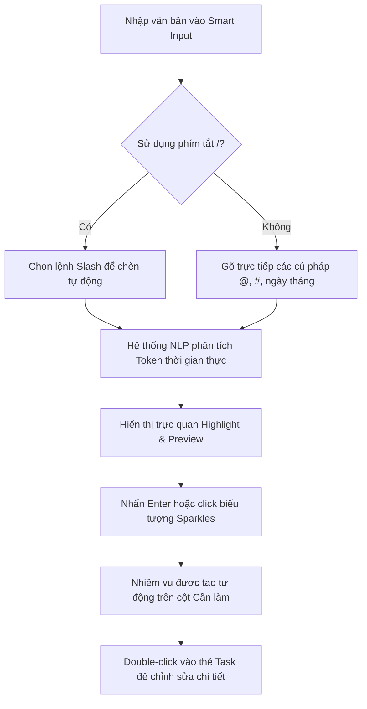

# Hướng Dẫn Chi Tiết Tạo và Quản Lý Công Việc (Tasks)

Chào mừng bạn đến với **Synapse Collaboration**! Hệ thống quản lý công việc của chúng tôi được thiết kế với giao diện Glassmorphism hiện đại và tích hợp công nghệ **Xử lý ngôn ngữ tự nhiên (NLP) Smart Input**, giúp bạn tạo nhanh công việc chỉ bằng một dòng lệnh mà không cần qua nhiều bước nhập liệu phức tạp.

Tài liệu này sẽ hướng dẫn chi tiết cách tạo công việc bằng hai phương thức chính:
1. **Tạo nhanh bằng NLP Smart Input** (Gợi ý phím tắt, nhận diện thông minh người thực hiện, độ ưu tiên, nhãn dán, thời hạn).
2. **Chỉnh sửa chi tiết bằng Task Editor Modal** (Mô tả, nhiều người thực hiện, thời gian bắt đầu/kết thúc, thảo luận nhóm).

---

## 🗺️ Quy Trình Tạo Công Việc

---

## ⚡ Phương Pháp 1: Tạo Nhanh Bằng NLP Smart Input

Khung nhập liệu thông minh (Smart Input) nằm ở đầu trang dashboard. Nếu khung nhập liệu đang bị thu nhỏ, hãy nhấp vào biểu tượng **Mũi tên xuống (Chevron)** ở góc phải của bảng điều khiển để mở rộng.

### 1. Phân Tích Cú Pháp Nhận Diện Tự Động (NLP Syntax)

Khi bạn gõ nội dung công việc, hệ thống sẽ quét các ký tự đặc biệt và từ khóa để tự động thiết lập các thuộc tính cho công việc:

| Ký tự / Từ khóa | Loại thuộc tính | Ví dụ nhập liệu | Kết quả nhận diện |
| :--- | :--- | :--- | :--- |
| **`@username`** | Người thực hiện (Assignee) | `@lan` hoặc `@huy` | Gán công việc cho Nguyễn Mai Lan hoặc Trần Thế Huy |
| **`#priority`** | Độ ưu tiên (Priority) | `#cao`, `#gap`, `#high` | Thiết lập mức độ ưu tiên **Khẩn cấp** |
| | | `#vua`, `#medium` | Thiết lập mức độ ưu tiên **Vừa** (Mặc định) |
| | | `#thap`, `#low` | Thiết lập mức độ ưu tiên **Thấp** |
| **`#tag_name`** | Nhãn dán (General Tag) | `#frontend`, `#bug`, `#design` | Tự động tạo và đính kèm nhãn dán |
| **Ngày/Tháng** | Hạn chót (Due Date) | `hôm nay`, `ngày mai`, `thứ sáu` | Tự động tính toán ngày hạn chót tương ứng |

> [!NOTE]
> Hệ thống hỗ trợ xử lý ngôn ngữ tự nhiên bằng cả tiếng Việt (có dấu hoặc không dấu) và tiếng Anh nhờ bộ lọc chuẩn hóa nguyên âm thông minh. Ví dụ `#khan-cap` hay `#gap` đều được nhận diện chính xác là độ ưu tiên Khẩn cấp.

---

### 2. Cú Pháp Thời Gian Thông Minh (Semantic Date Rules)

Bạn có thể nhập thời hạn bằng nhiều cách linh hoạt:

*   **Thời gian tương đối**: 
    *   `hôm nay` / `today` $\rightarrow$ Hạn chót là ngày hiện tại lúc 17:00.
    *   `ngày mai` / `tomorrow` $\rightarrow$ Hạn chót là ngày tiếp theo lúc 17:00.
    *   `ngày kia` $\rightarrow$ Hạn chót là 2 ngày sau.
    *   `tuần sau` / `next week` $\rightarrow$ Hạn chót là ngày này tuần sau.
*   **Thứ trong tuần**:
    *   `thứ hai` / `t2` / `monday` / `mon` $\rightarrow$ Thứ Hai gần nhất.
    *   `thứ sáu tuần sau` $\rightarrow$ Thứ Sáu của tuần kế tiếp.
*   **Ngày tuyệt đối**:
    *   `25/12` hoặc `10-08` $\rightarrow$ Tự động gán ngày cụ thể trong năm hiện tại (hoặc năm sau nếu ngày đó đã qua).
*   **Khoảng cách số ngày**:
    *   `2 ngày nữa` / `3d` / `5 days` $\rightarrow$ Gán hạn chót sau số ngày tương ứng kể từ hôm nay.

---

### 3. Trình Đơn Phím Tắt Lệnh Slash (`/`)

Để tăng tốc độ nhập liệu mà không cần nhớ cú pháp, hãy gõ ký tự `/` trong ô nhập liệu. Một menu thả xuống (dropdown) sẽ xuất hiện cho phép chọn nhanh các lệnh:

*   **`/assign`**: Chèn nhanh `@` để chọn thành viên.
*   **`/high`**: Chèn nhanh `#cao` (Độ ưu tiên Khẩn cấp).
*   **`/medium`**: Chèn nhanh `#vua` (Độ ưu tiên Vừa).
*   **`/low`**: Chèn nhanh `#thap` (Độ ưu tiên Thấp).
*   **`/today`**: Chèn nhanh `hôm nay` (Đặt hạn chót).
*   **`/tomorrow`**: Chèn nhanh `ngày mai` (Đặt hạn chót).

> [!TIP]
> Bạn có thể sử dụng các phím mũi tên **Lên/Xuống (ArrowUp/ArrowDown)** để di chuyển trong các menu gợi ý và nhấn **Enter** hoặc **Tab** để chọn nhanh lựa chọn mong muốn.

---

### 4. Gợi Ý Tự Động Thông Minh (Autocomplete Suggestions)

Để tối ưu hóa tốc độ và độ chính xác khi nhập liệu, hệ thống tự động hiển thị menu gợi ý trực quan khi bạn gõ các ký tự kích hoạt đặc biệt:

*   **Gợi ý Thành viên (`@`)**: Khi gõ ký tự `@`, danh sách thành viên sẽ xuất hiện. Bạn có thể tiếp tục gõ để lọc nhanh theo tên hoặc username (ví dụ: `@l` để tìm Lan hoặc Lộc).
*   **Gợi ý Độ ưu tiên & Nhãn dán (`#`)**: Khi gõ ký tự `#`, hệ thống sẽ liệt kê các mức độ ưu tiên (`#cao`, `#vua`, `#thap`) và danh sách các nhãn dán đã từng được sử dụng. Nếu bạn muốn gõ một nhãn mới chưa từng có, hệ thống sẽ đề xuất **"Tạo nhãn mới: #tên_nhãn"**.
*   **Gợi ý Thời hạn (`//`)**: Khi gõ hai ký tự `//`, danh sách các phím tắt thời gian thông minh (Hôm nay, Ngày mai, Ngày kia, Tuần sau, Thứ hai tới...) sẽ hiện ra cùng với **ngày tháng cụ thể tương ứng** trong ngoặc đơn. Đồng thời, có thêm tùy chọn **"Chọn từ lịch..."** giúp hiển thị bảng lịch Glassmorphism tùy chỉnh trực quan. Bảng lịch này hiển thị song song **Dương lịch** và **Âm lịch** (màu vàng), tự động làm nổi bật các **ngày nghỉ cuối tuần** (màu đỏ) và các **ngày nghỉ lễ** của hệ thống (nền đỏ/hồng nhạt, hiển thị tooltip tên ngày lễ khi rê chuột qua), giúp bạn dễ dàng chọn chính xác ngày hạn chót mong muốn. Ngày được chọn sẽ tự động điền vào ô nhập liệu dưới dạng `dd/mm` (ví dụ `25/06`).

---

### 5. Giao Diện Trực Quan Khi Nhập Liệu

Khi bạn nhập văn bản, giao diện sẽ phản hồi trực quan theo hai cách:
1.  **Tô màu văn bản (Highlighting)**:
    *   Tên người dùng `@username` được tô màu **Tím**.
    *   Độ ưu tiên được tô màu theo mức độ (Đỏ cho `#cao`, Vàng cho `#vua`, Xanh lá cho `#thap`).
    *   Thời gian được tô màu **Xanh cyan**.
    *   Nhãn dán được tô màu **Xám nhạt**.
2.  **Bản xem trước nhiệm vụ (NLP Preview Card)**:
    Phía dưới ô nhập sẽ hiển thị một thẻ xem trước thời gian thực giúp bạn kiểm tra các thông tin đã được phân tích đúng chưa trước khi tạo công việc chính thức.

> [!IMPORTANT]
> Sau khi kiểm tra thông tin trên thẻ xem trước, nhấn phím **Enter** (không nhấn kèm Shift) hoặc nhấp vào nút **Sparkles** (biểu tượng lấp lánh AI) để lưu công việc lên cột **Cần làm (Todo)**.

---

### 6. Ví Dụ Mẫu Nhập Liệu Nhanh

Dưới đây là một số câu lệnh mẫu bạn có thể copy và thử nghiệm ngay trên thanh Smart Input:

*   **Ví dụ 1**: `Thiết kế màn hình Dashboard UI @lan #cao ngày mai #figma`
    *   *Kết quả*: Tạo task tên là *"Thiết kế màn hình Dashboard UI"*, giao cho *Nguyễn Mai Lan*, độ ưu tiên *Khẩn cấp*, hạn chót là *ngày mai*, đính kèm thẻ *#figma*.
*   **Ví dụ 2**: `Viết tài liệu hướng dẫn tạo task cho người dùng @loc thứ sáu tuần sau #docs`
    *   *Kết quả*: Tạo task tên là *"Viết tài liệu hướng dẫn tạo task cho người dùng"*, giao cho *Võ Vĩnh Lộc*, độ ưu tiên *Vừa* (mặc định), hạn chót vào *thứ Sáu tuần sau*, đính kèm thẻ *#docs*.
*   **Ví dụ 3**: `Fix lỗi font chữ trên Safari #thap hôm nay #bug`
    *   *Kết quả*: Tạo task *"Fix lỗi font chữ trên Safari"*, không gán người thực hiện cụ thể (mặc định sẽ gán cho chính bạn), độ ưu tiên *Thấp*, hạn chót là *hôm nay*, đính kèm thẻ *#bug*.

---

## 🛠️ Phương Pháp 2: Chỉnh Sửa Chi Tiết (Task Editor Modal)

Mặc dù Smart Input giúp bạn tạo công việc cực nhanh, nhưng đôi khi bạn cần cấu hình các thông số chi tiết hơn.

### 1. Cách Mở Bảng Chỉnh Sửa Chi Tiết

Có hai cách để mở bảng chỉnh sửa chi tiết của một công việc:
1.  **Nhấp đúp chuột (Double-click)** vào bất kỳ thẻ công việc nào trên Kanban Board.
2.  Nhấp vào biểu tượng **Bút chì (Edit)** ở góc trên bên phải của thẻ công việc.

---

### 2. Các Tính Năng Nâng Cao Trong Bảng Điều Chỉnh

Khi bảng Modal hiện lên, bạn có thể thực hiện các tùy chỉnh nâng cao sau:

*   **Chỉnh sửa tiêu đề & Mô tả**: Nhập mô tả chi tiết của công việc để đồng đội dễ dàng nắm bắt yêu cầu.
*   **Giao việc cho nhiều người**: Khác với Smart Input chỉ gán nhanh một người qua cú pháp `@`, trong Modal chỉnh sửa bạn có thể tích chọn **nhiều thành viên** cùng thực hiện một nhiệm vụ.
*   **Cài đặt Ngày bắt đầu (Start Date) và Hạn chót (Due Date)**: Lên lịch biểu rõ ràng giúp theo dõi tiến độ tốt hơn.
*   **Quản lý nhãn dán chuyên sâu**: Thêm mới hoặc xóa bớt các nhãn dán (`tags`) tùy ý bằng giao diện trực quan.
*   **Phần Thảo luận (Comments Feed)**:
    *   Đồng bộ thời gian thực cho phép các thành viên trao đổi trực tiếp dưới mỗi thẻ công việc.
    *   Hỗ trợ gửi bình luận nhanh và xem lịch sử phản hồi trực quan từ các đồng nghiệp khác.

---

## 🔄 Tính Năng Hoàn Tác & Làm Lại (Undo / Redo)

Trong quá trình thao tác trên thẻ công việc (di chuyển cột, thay đổi độ ưu tiên nhanh, đổi người thực hiện hoặc thậm chí là **Xóa công việc**):

*   Hệ thống sẽ hiển thị một **Toast thông báo** ở góc màn hình kèm nút **Hoàn tác (Undo)**. Bạn có thể nhấn vào nút này hoặc sử dụng phím tắt **`Ctrl + Z`** (hoặc **`Cmd + Z`** trên Mac) để khôi phục lại trạng thái cũ ngay lập tức.
*   Nếu muốn thực hiện lại hành động vừa hoàn tác, hãy dùng phím tắt **`Ctrl + Y`** (hoặc **`Cmd + Shift + Z`** trên Mac) để **Làm lại (Redo)**.

---

Chúc bạn có những trải nghiệm làm việc hiệu quả và nhanh chóng cùng **Synapse Collaboration**!
